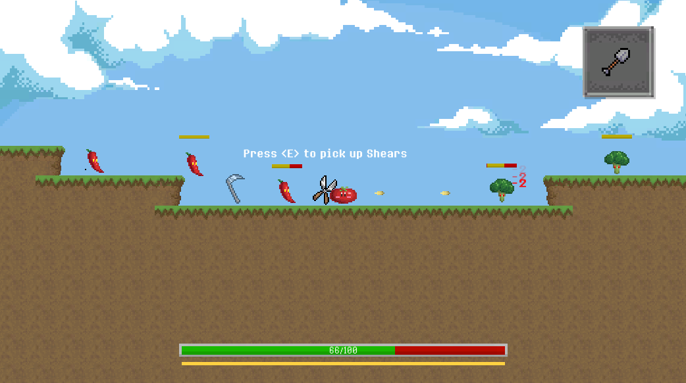
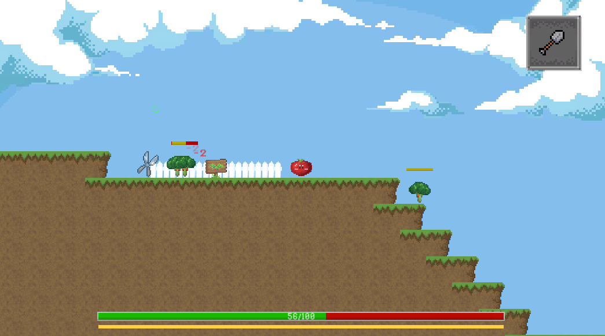
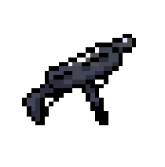
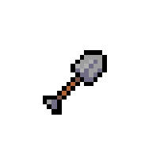
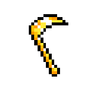
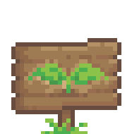

# Fruits of Labour
(*currently in development: v0.3*)

*Terrance, the tomato seeks to restore the lost glory of the tomato fruit. Help Terrance blast through hordes of angry vegetables using shovels, shears, and even revolvers on his way to prove once and for all that a tomato is in fact a fruit.*

*To play the game, download the ZIP latest version from the* Game *folder, and extract the files to a new location. Run the* "Fruits of Labour" *application file.*

## Gameplay
Fruits of Labour is a single-player, vegetable based shooter game. Explore the map and kill enemies while powering yourself up with cool new items. 




### Controls
* Press the **Left** and **Right** arrow keys to move.
* Press **Space** to jump.
* **Double tap** the arrow key in a direction to do a short dash.
* Press **Q** to shoot.
* Press **E** next to items to pick them up.
* Press **W** to interact with terrain.

### Items
Enemies have a change of dropping items when killed. The more powerful the item, the rarer it is. Item despawn after a couple seconds, so pick them up quick!





**Weapons** can be equiped to deal more damage, shoot faster, or change your attack patterns entirely. Only one weapon can be equipped at a time, so you must drop your current weapon to pick up a new one.




**Modifiers** stay with you the whole game. Picking them up can increase stats like health and speed or provide cool bonuses during gameplay.

### Soil
New enemies sprout from patches of soil marked with a **Sign**. Interacting with soil will stomp it out, meaning enemies will no longer sprout there.



Each patch of soil can only sustain a couple of nemies at a time. Once this number is reached, no new enemies will appear until one has been killed. 

Once every patch of soil has been stomped out, the **Boss** for the level can be summoned. To summon the boss, explore the map until you find it's terrain markers. Interacting with these markers will cause the boss to appear. In order to complete the level, the boss must be summoned and defeated.

## Development
Fruits of Labour is developed using Unity and Visual Studio. Graphic assets are created in Adobe Photoshop. Sound assets are edited with Audacity.

### Included features
* Basic movement, dashing, shooting, collision detection, and damage
* Enemy spawning and AI
* Item system (enemies drop items, items can be picked up to apply effects, item drop rates based on rarity)
* Minimalistic UI (healthbar, energy, current weapon)\
* Pause functionality
* Boss fight

### Planned features
* Improved enemy spawning behaviour
* Multiple levels

### Known bugs
* Dashes will occasionally stops short - *Cause unknown.*
* Standing against walls lets you double jump - *Known cause: state machines doesn't account for this case. Fix pending.*
* Dying enemies sometimes fall through the floor - *Suspected cause: overlapping enemies wrongly applying forces.*

## Credits
* **Design & Development** - Ben Liu
* **Graphic Design** - Ben Liu
* **Sound Effects** - *zapsplat.com*, *freesounds.org*
* **Sound Editing** - Ben Liu
*  **Music** - *soundimage.org*


# Change Log

2019-01-14: *version 0.3*
```
Functionality:
+ Spawners can be deactivated
+ Spawners can have prerequisites
+ Boss fight
+ Enemy projectiles
+ Title screen

Content:
+ Terrain: Signs
+ Terrain: Fences
+ Terrain: Vines
+ Enemy: Pumpkin Boss
```

2018-12-15: *version 0.2*
```
Functionality:
+ Pausing functionality
+ Restart functionality
+ Pause menu options
+ Rarity dependent item drop rate
+ Item type: Bubble
- Invulnerability animation while spawning
> UI scaling changed from Static -> Dynamic

Content:
+ Bubble: Health
+ Modifier: Sickle
+ Modifier: Golden Sickle
+ Modifier: Water Drop
- Modifier: Health
```
2018-12-14: *version 0.1*
```
Functionaliy:
+ Basic movement
+ Dashing
+ Projectile system
+ Collision detection
+ Damage system
+ Death system
+ State machine
+ Enemy AI
+ Item system
+ Item type: Weapon
+ Item type: Modifier
+ Item drops
+ Item rarities
+ Item pick up
+ Health bar
+ Energy bar
+ Inventory

Content:
+ Weapon: Shovel
+ Weapon: Shear
+ Weapon: Uzi
+ Weapin: Magnum
+ Modifier: Fertilizer
+ Modifier: Watering Can
+ Modifier: Health
+ Terrain: Ground tiles
+ Enemy: Broccoli
+ Enemy: Red Pepper
```
