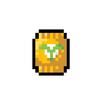
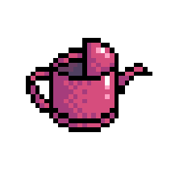

# Fruits of Labour
(*currently in development: v0.2*)

*Terrance, the tomato seeks to restore the lost glory of the tomato fruit. Help Terrance blast through hordes of angry vegetables using shovels, shears, and even revolvers on his way to prove once and for all that a tomato is a in fact fruit.*

## Gameplay
Fruits of Labour is a single-player, vegetable based shooter game. Explore the map and kill enemies while powering yourself up with cool new items. 


### Controls
* Press the **Left** and **Right** arrow keys to move.
* Press **Space** to jump.
* **Double tap** the arrow key in a direction to do a short dash.
* Press **Q** to shoot.
* Press **E** next to items to pick them up.

### Items
Enemies have a change of dropping items when killed. The more powerful the item, the rarer it is. Item despawn after a couple seconds, so pick them up quick!


**Weapons** can be equiped to deal more damage, shoot faster, or change your attack patterns entirely. Only one weapon can be equipped at a time, so you must drop your current weapon to pick up a new one.





**Boons** stay with you the whole game. Picking up boons can increase your stats like health and speed or they can provide cool bonuses during gameplay.

## Development
Fruits of Labour is developed using Unity and Visual Studio. Graphic assets are created in Adobe Photoshop. Sound assets are edited with Audacity.

### Included features
* Basic movement, dashing, shooting, collision detection, and damage
* Enemy spawning and AI
* Item system (enemies drop items, items can be picked up to apply effects, item drop rates based on rarity)
* Simple UI elements (healthbar, energy, current weapon)\
* Pause menu

### Planned features
* Improved enemy spawning behaviour
* Main menu
* Multiple levels
* Boss fights

### Known bugs
* Dashes will occasionally stops short - *Cause unknown.*
* Standing against walls lets you double jump - *Known cause: state machines doesn't account for this case. Fix pending.*
* Dying enemies sometimes fall through the floor - *Suspected cause: overlapping enemies wrongly applying forces.*

## Credits
* **Design & Development** - Ben Liu
* **Graphic Design** - Ben Liu
* **Sound Effects** - *zapsplat.com*, *freesounds.org*
* **Sound Editing** - Ben Liu
*  **Music** - *soundimage.org*


# Change Log
2018-12-15: *version 0.2*
```
+ Pausing functionality
+ Restart functionality
+ Pause menu options
+ Dynamic UI Scaling
```
2018-12-14: *version 0.1*
```
+ Basic movement
+ Dashing
+ Projectile system
+ Collision detection
+ Damage system
+ Death system
+ State machine
+ Enemy AI
+ Item system
+ Item drops
+ Item rarities
+ Item pick up
+ Health bar
+ Energy bar
+ Inventory
```
